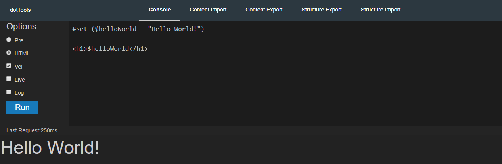
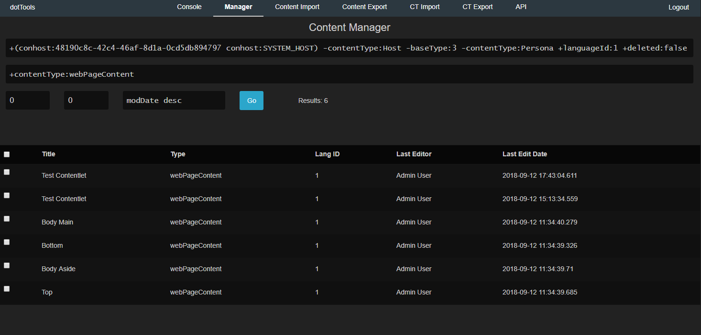
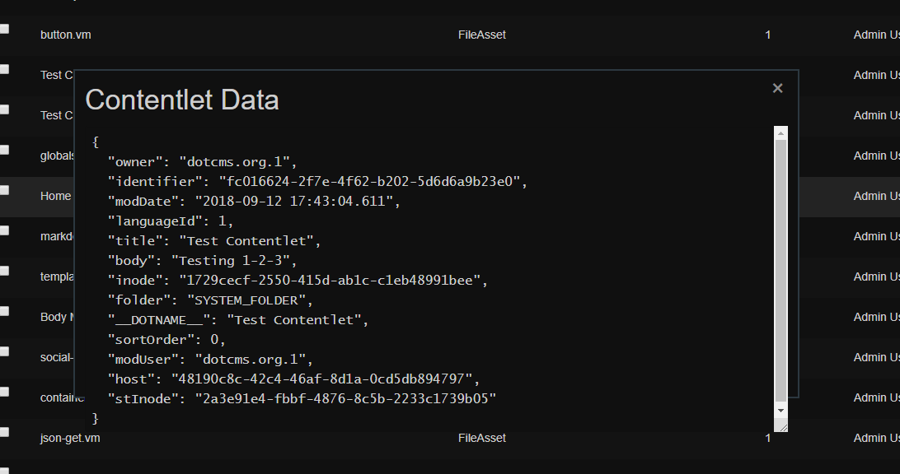
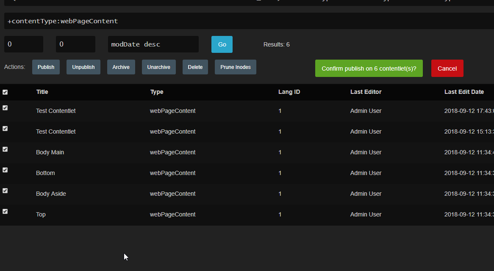
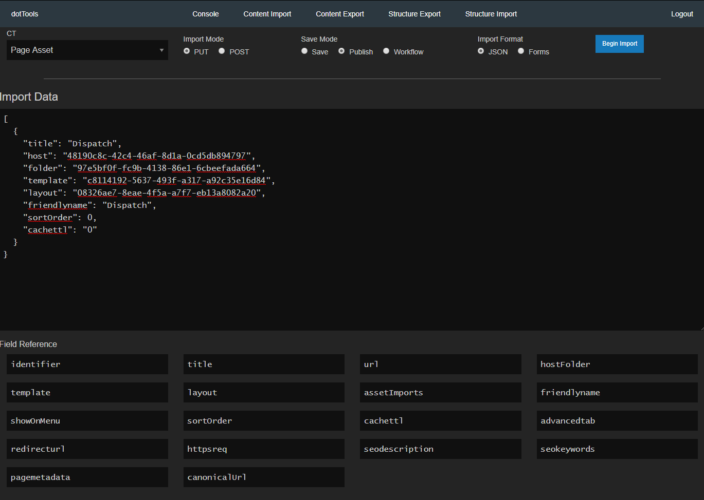
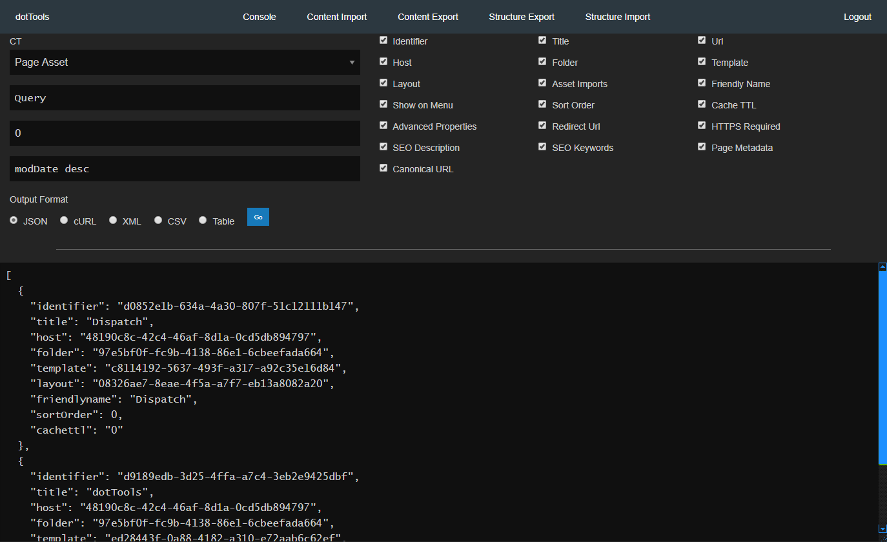
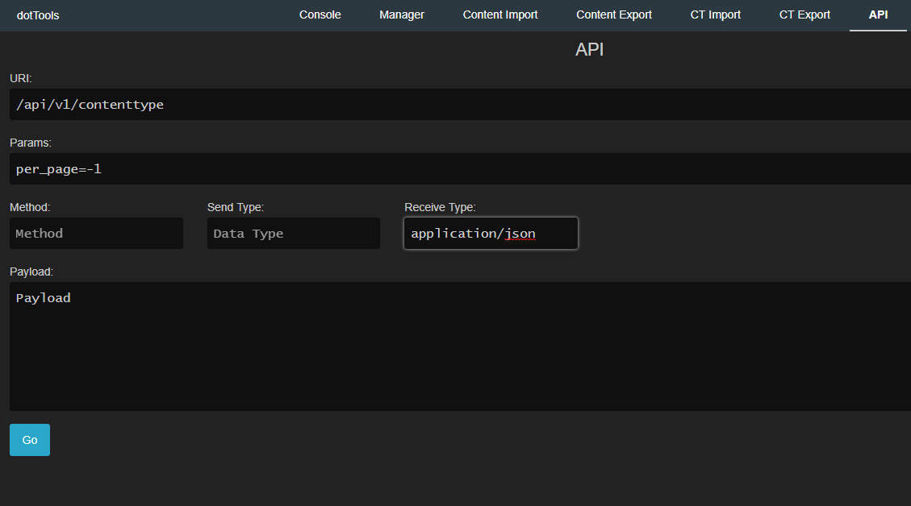
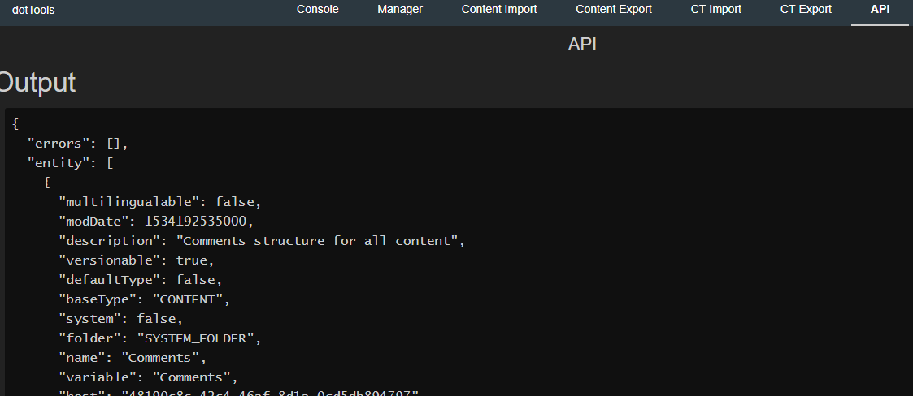

# dotTools Utilities (Beta)

dotTools is a back-end UI for performing various utility functions in dotCMS.


# Getting Started

## Prerequisites

* Have dotCMS extracted and appropriate config and root folder Plugins directories ready to go

&nbsp;&nbsp;&nbsp;&nbsp;&nbsp;
See [dotCMS installation guide](https://github.com/x0rsw1tch/DotCMSVelocity/blob/master/dotcms-installation.md#dotcms-installation-1) for information on how to set this up.


## Compatibility

| Feature             | 3                  | 4                  | 5        
| --------------------|--------------------|--------------------|-------------------
| Velocity Console    | :heavy_check_mark: | :heavy_check_mark: | :heavy_check_mark:
| Content Manager     | :heavy_check_mark: | :heavy_check_mark: | :heavy_check_mark:
| Content Import      | :heavy_check_mark: | :heavy_check_mark: | :heavy_check_mark:
| Content Export      | :heavy_check_mark: | :heavy_check_mark: | :heavy_check_mark:
| Content Type Import | :x:                | :heavy_check_mark: | :heavy_check_mark:
| Content Type Export | :x:                | :heavy_check_mark: | :heavy_check_mark:
| API Interactor      | :heavy_check_mark: | :heavy_check_mark: | :heavy_check_mark:

> Please Note: dotTools for dotCMS 3 has only been tested with 3.7.2. Earlier versions may not work properly


## Installation

1. Extract Tarball to (dotCMS 5):
    + `plugins/com.dotcms.config/ROOT/dotserver/tomcat-8.5.32/webapps/ROOT/dottools`
	
	or for v3.x, 4.x
	
	+ `plugins/com.dotcms.config/ROOT/dotserver/tomcat-8.0.18/webapps/ROOT/dottools`

Example: 

From dotCMS Root: `mkdir -p  plugins/com.dotcms.config/ROOT/dotserver/tomcat-8.5.32/webapps/ROOT/dottools`
Then: `tar -zxvf dottools.tar.gz -C plugins/com.dotcms.config/ROOT/dotserver/tomcat-8.5.32/webapps/ROOT/dottools`

<sub>You may substitute `dottools` for another directory name.</sub>

---
# What's Included

* dotCMS Velocity console: Test and run Velocity Scripts in real-time
* Content Manager: Apply mass workflow statuses to contentlets, prune contentlet inodes, and get contentlet JSON data
* Contentlet Export/Import: Import and export contentlets with JSON, XML, CSV, or HTML Table
* Content Type (Structure) Import/Export: Easily Transfer Content Types between instances, without the need for Bundles/Push Publishing
* API Interactor: Work with dotCMS/Spring or other HTTP API's from within the UI


---
# How to Use

To utilize the capabilities of the included tools, check out the indiviudal sections below.

<sub>**Pro Tip**: Add `?nologin` to skip authentication. Items requiring authentication will not function.</sub>

## Console



Allows you to run Velocity code and get results on the fly. This is very useful for testing, generating scripts, or prototyping.

### Console Options

| Option  | Function
| ------- |--------------
| Pre     | Use Pre-formatted output
| HTML    | Use HTML output
| Vel     | Evaluate Velocity Code
| Live    | Live Update
| Log     | Log each submitted entry

<sub>Pro Tip: Use Ctrl+Enter to "Run"</sub>

### History

Shows a history of each code submitted 

#### Useful things

Snippets and misc things Velocity

## Content Manager

Provide a Lucene Query and a list of contentlets will appear. There are two functions that can occur from here:




1. Get contentlet JSON data by clicking on the contentlet title




2. Select one or more contentlets to apply workflow actions, or prune old inodes

 > Pro Tip: Since dotCMS 5 creates new inodes after applying workflow actions, be sure to refresh the list if applying another action.



## Content Import

Provide an Array of objects to import contentlets, or fill out input fields for quick importing. 




## Content Export

Allows for exporting dotCMS contentlets in various formats. The fields to be exported can be deselected.

Export Formats:
```
JSON
cURL commands
XML
CSV
HTML Table
```




## Structure (CT) Export

Select a Content Type to export. In the results box you will get JSON Object with the following structure:

```
{
	structure: {
		...
	},
	fields: [
		{
			...Field Object...
		}
	]
}

```


## Structure (CT) Import

Provide a JSON object in the format described above. Required properties are listed in the dotCMS documentation:

The Content Type will be created first, followed by each individual field.

[Create Content Type](https://dotcms.com/docs/latest/content-type-api#createContentType)

[Create Field](https://dotcms.com/docs/latest/fields-content-type-api#createField)


## API Interactor



Supply the appropriate parameters and click go, you will be taken to a results window to see the response.

